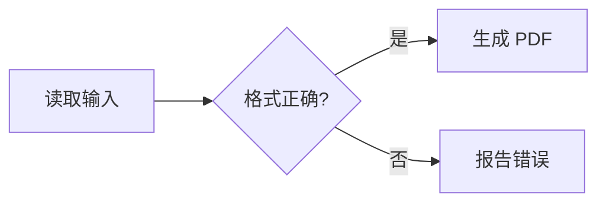
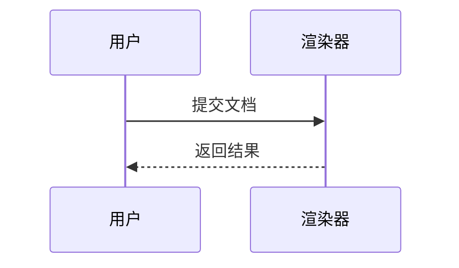

# Mermaid 回归样例

本文件检查 Mermaid 图表被画成 SVG：节点文字应出现在 PDF 里，图表源码和错误提示不应出现。

```mermaid
flowchart LR
    A[读取输入] --> B{格式正确?}
    B -- 是 --> C[生成 PDF]
    B -- 否 --> D[报告错误]
```

```mermaid
sequenceDiagram
    participant U as 用户
    participant R as 渲染器
    U->>R: 提交文档
    R-->>U: 返回结果
```
